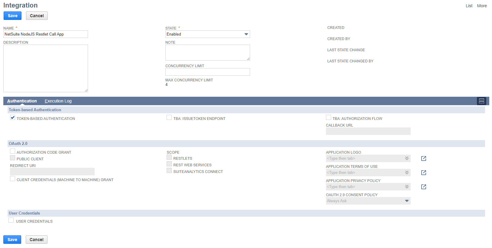
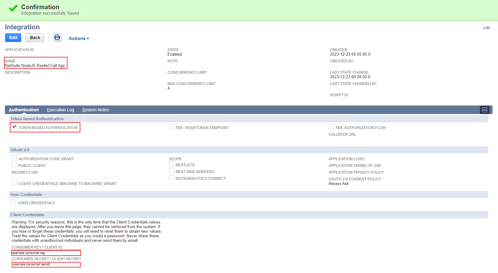
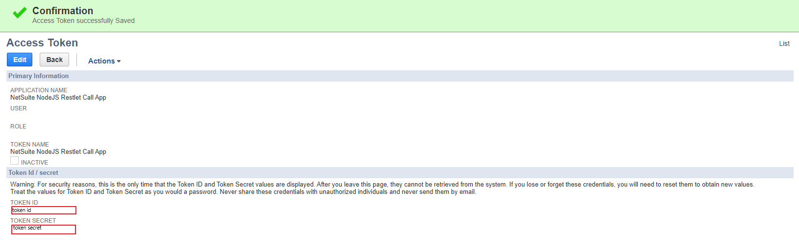
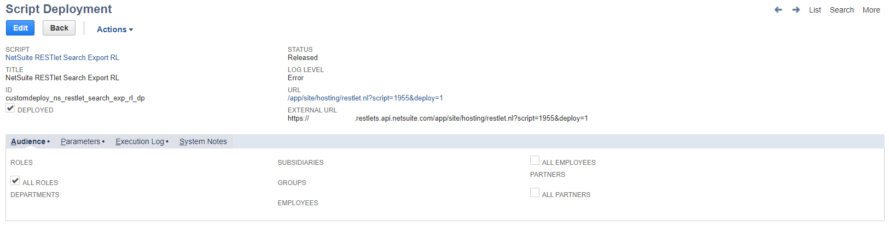
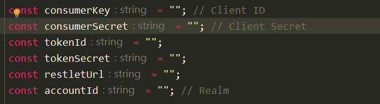
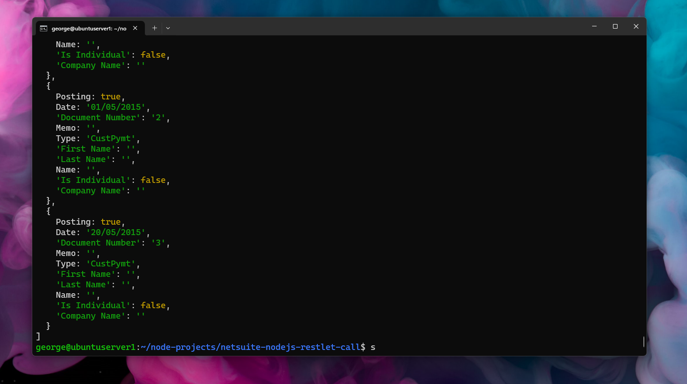

# NetSuite NodeJS Restlet Call & How-To
Simple NodeJS app that call NetSuite RESTlet and get JSON data

## Used libraries
- oauth-1.0a
- crypto-js
- axios

## How to deploy
- clone repo
- do "npm install" in repo folder
- edit index.js with vim :) and fill consumerKey, consumerSecret, tokenId, tokenSecret, restletUrl, accountId
- run app with "node index.js"
- see your RESTlet returning data :)

## How to get Oauth keys from NetSuite ?
1. Go to Setup > Integration > Manage Integrations > New 
 - In name enter "NetSuite NodeJS Restlet Call App"
 - Check "Token-Base Authentication" and uncheck all other checkboxes

2. Click "Save"

- After succesfull Save write down "Consumer Key / Client" & "Consumer Secret / Client Secret"
3. Create new role go to Setup > Users/Roles > Manage Roles > New
 - Check "Web Services Only Role"
 - On the Permissions tab
   - Setup subtab
     - Add "Integration Application"
     - Add "Log in using Access Tokens"
     - Add "User Access Tokens"
     - ... any other needed permissions
 - Click "Save"
4. Add newly created role to your user
    - Setup > Users / Roles > Manage Users
    - Edit your User
    - In "Access" tab add the role created in step 3
5. Create Token ID / Token Secret
   - Go to Setup > Users / Roles > Access Tokens > New
   - On "Aplication Name" choose "NetSuite NodeJS Restlet Call App"
   - On "User" choose your user
   - On "Role" choose role you created in step 3
   - Click on "Save"
   - After successfull save write down "Token ID / Token Secret"

6. Get Account ID / Realm
   - Go to Setup > Integration > SOAP Web Services Preferences > Account ID
7. Get Restlet UR
   - Go to the Script deployment of the RESTlet and Copy "External URL"
     
8. With all this information entered in index.js you can now call your RESTlet with "node index.js"

## Screenshots
